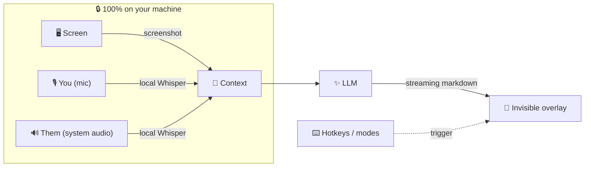

<div align="center">

# 👻 FreelyCluely

### *Don't pay. Be freely Cluely.*

An open-source, **stealth AI overlay** for macOS that watches your screen, hears your calls,
and streams you the answer — all from a window that's **invisible to screen sharing**. 🫥

A fully-working, self-hostable replica of [Cluely](https://cluely.com) — minus the subscription.

<br/>


<br/>

`⌘\` to toggle · `⌘↵` to ask about your screen · `⌘⇧L` to start listening

</div>

---

## 🪄 What is this?

You're on a call. A tricky question lands. Somewhere off to the side — where **no screen recording, no Zoom share, no OBS capture can see it** — a little glass panel quietly types out the perfect answer.

That's FreelyCluely. It runs entirely on your machine, transcribes with **local Whisper** (nothing leaves your laptop until *you* pick a cloud LLM), and stays out of the way until you tap a hotkey.

> [!NOTE]
> Built as a technical & educational project — the fun part is the stealth-overlay + real-time-context engineering. Use it responsibly, honestly, and only where you're actually allowed to. 💛

---

## ✨ Features

| | |
|---|---|
| 🫥 **Invisible overlay** | Frameless, translucent, always-on-top, follows you across Spaces, hidden from Mission Control — and excluded from screen capture via `setContentProtection`. |
| 📸 **Sees your screen** | One hotkey grabs the display and pipes it to a vision model. |
| 🎙️ **Hears *both* sides** | Your mic **and** the meeting's system audio — captured natively through the app's own Screen-Recording grant, **no BlackHole required**. |
| 🗣️ **Knows who's talking** | Dual-channel transcript labels your mic as **You** and system audio as **Them**, so the model has real conversational context. |
| 🎯 **Meeting modes** | One tap for **Assist**, **What to say**, **Follow-ups**, **Recap**, or a dedicated **Solve** (coding) — each with its own tuned prompt. |
| ⚡ **Real-time answers** | Streamed token-by-token, **Markdown-rendered** (code blocks, lists, the works) with one-click copy. |
| 🎛️ **Menu-bar native** | No Dock icon. A tray menu drives everything — show/hide, ask, listen, quit. |
| 🖱️ **Ghost click-through** | Empty overlay areas pass clicks *through* to the app behind; controls stay live. Hotkey forces full pass-through. |
| 🧭 **Guided first run** | An onboarding walkthrough wires up permissions, your AI key, and the Zoom stealth setting. |
| 🔌 **Bring your own brain** | Ships with a zero-config **mock** provider. Drop in **Claude**, **GPT-4o**, or **Gemini** whenever. |
| 🎙️ **Local transcription** | Audio → 16 kHz chunks → **local Whisper** (whisper.cpp). Nothing leaves your machine. |
| 🧠 **Remembers itself** | Window position, size, and your settings persist between launches. |

---

## 🧬 How it works



Everything left of the LLM box runs **100% on-device**. The only thing that ever touches the network is the answer request — and only once you plug in an API key.

---

## 🚀 Quick start

```bash
npm install      # Electron (+ tries to grab nodejs-whisper)
npm start        # 👻 the overlay floats up
```

That's it. On first launch the **entire pipeline works with zero API keys** — overlay, screenshots, hotkeys, and transcription all run against the built-in **mock** provider so you can feel the whole thing before committing to anything.

<details>
<summary><b>🗣️ Turn on real transcription</b></summary>

```bash
npm run whisper:setup   # builds whisper.cpp + downloads a model (needs cmake + Xcode CLT)
```
</details>

<details>
<summary><b>🧠 Plug in a real LLM</b></summary>

1. `cp .env.example .env` and paste in your key.
2. Open **⚙️ Settings** in the app and pick your provider — `anthropic`, `openai`, or `gemini` — or set it in config:
   ```json
   { "ai": { "provider": "anthropic" } }
   ```
3. Restart. Done. ✅
</details>

---

## ⌨️ Hotkeys

| Action | Keys |
|---|:---:|
| 👁️ Show / hide overlay | `⌘` `\` |
| ✨ Assist (screen + convo) | `⌘` `↵` |
| ◇ Solve what's on screen | `⌘` `⇧` `↵` |
| 💬 What should I say | `⌘` `⇧` `S` |
| 💬 Quick ask (focus input) | `⌘` `⇧` `Space` |
| 🎙️ Toggle listening | `⌘` `⇧` `L` |
| 🖱️ Ghost click-through | `⌘` `⇧` `M` |
| 🧹 Clear context | `⌘` `⇧` `K` |
| ↔️ Move overlay | `⌘` `+` arrows |
| 🛑 Quit | `⌘` `⇧` `Q` |

*Every binding is remappable in the config file (or `~/.freelycluely/config.json`).*

---

## 🔐 macOS permissions

The app checks these for you and deep-links you straight to the right pane if anything's missing:

- **Screen Recording** → so it can screenshot (Privacy & Security → Screen Recording).
- **Microphone** → so it can hear and transcribe.

---

## 🗂️ Architecture

```
src/
├── main/                 # ⚙️ Electron main process
│   ├── main.js           #    lifecycle, IPC, orchestration
│   ├── window.js         #    the stealth overlay window
│   ├── tray.js           #    menu-bar icon + context menu
│   ├── permissions.js    #    macOS screen/mic checks + deep links
│   ├── shortcuts.js      #    global hotkeys
│   ├── screenshot.js     #    desktopCapturer screen grab
│   ├── transcription.js  #    local Whisper wrapper
│   ├── prompts.js        #    meeting/interview mode prompts
│   ├── config.js         #    layered config (defaults + overrides)
│   └── ai/               #    🔌 provider abstraction
│       └── providers/    #       mock · anthropic · openai · gemini
├── preload/preload.js    # 🔒 safe IPC bridge (contextIsolation)
└── renderer/             # 🎨 overlay UI
    ├── renderer.js       #    UI logic, dual-channel audio + WAV encoding
    └── markdown.js       #    tiny XSS-safe Markdown renderer

assets/   🎨 icons generated from code (npm run icons)
build/    📦 electron-builder entitlements
scripts/  🛠️ icon generator + whisper setup
```

---

## 📦 Ship it

```bash
npm run dist        # 🍏 build a .dmg + .zip into dist/ (universal macOS)
npm run dist:dir    # unpacked .app for a quick local test
npm run icons       # regenerate the app + tray icons from code
```

Packaging is wired up in `package.json`: universal mac targets, hardened-runtime entitlements, `LSUIElement` accessory mode (menu-bar only), and the mic/screen usage strings macOS demands.

> [!TIP]
> **Capturing the *other* side of a call?** It just works — system audio is captured natively through the app's own Screen-Recording grant (Electron loopback), so **no BlackHole or virtual audio device needed**. Grant Screen Recording, hit 🎙 Listen, and you'll see a **system** chip light up. (Needs macOS 13+; toggle listening from the mic button so the capture keeps its user-gesture.)

---

## 🛠️ Tech stack

**Electron** (loopback system-audio capture) · **Node.js** · **whisper.cpp** (local STT) · **Claude / GPT-4o / Gemini** (pluggable vision LLMs) · a hand-rolled **XSS-safe Markdown renderer** · zero UI frameworks — just clean HTML/CSS/JS.

---

<div align="center">

**MIT Licensed** — do whatever, just be cool about it. 💛

*Made for the curious. Powered by good hotkeys.*

</div>
